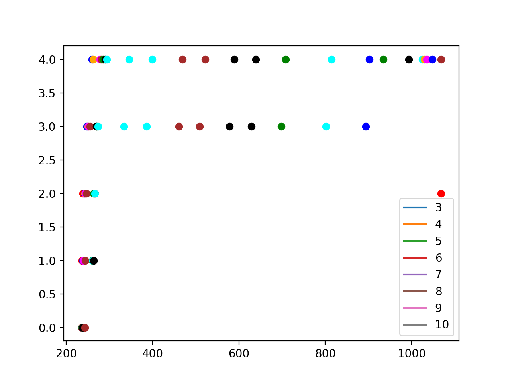
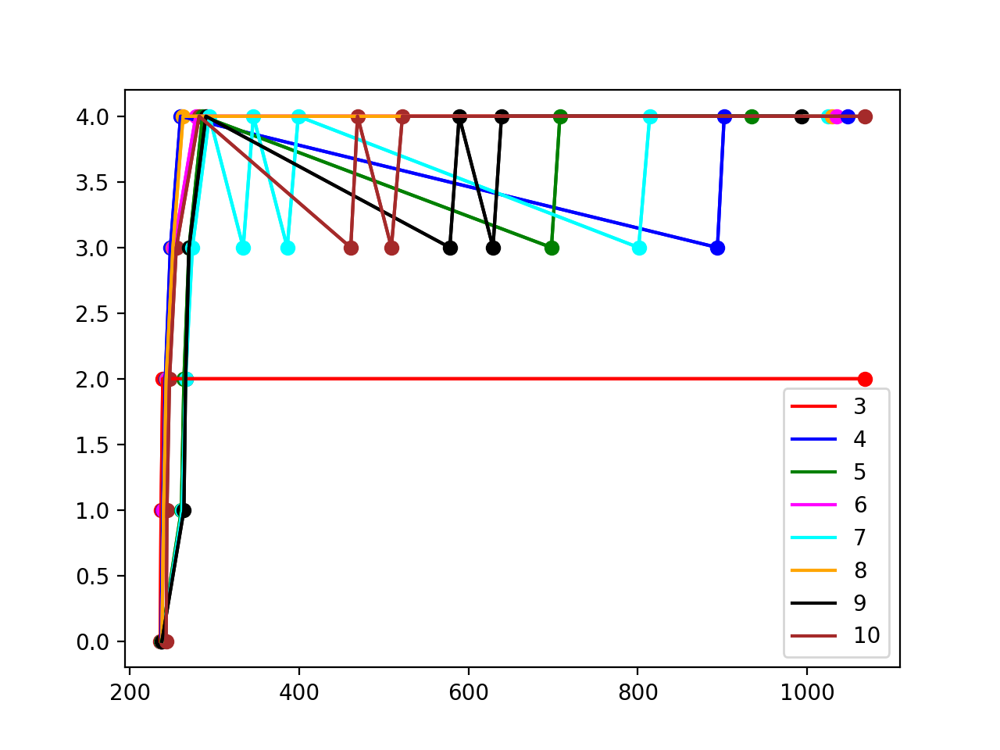

# xv6-tweaks

## System calls

### waitx()

#### Synonsis
```c
int waitx(int* wtime, int*rtime)
```
#### Description
The two arguments are pointers to integers to which waitx will assign the total number of clock ticks during which process was waiting and the total number of clock ticks when the process was running.
#### Return values
It returns the 0 on success, and -1 on failure.<br><br>

The user command `time` can be used to get the waiting and running times of any process. For e.g
```shell
$time benchmark
```
### set_priority()

#### Synopsis
```c
int set_priority(int new_priority, int pid)
```
#### Description
The system-call sets the priority of a process `pid` to `new_priority` between 0 to 100. In case the priority of the process increases (the value is lower than before), then rescheduling should be done immediately (for PBS scheduler).

#### Return values
It returns the `old_priority` on success, and -1 on failure.<br><br>.

### ps()

#### Synopsis
```c
void ps()
```

#### Description
This system call lists some basic information about all the active processes as explained.
- `Priority` - ​Current priority of the process (defined as per the need of schedulers below)
- `State` - ​Current state of the process
- `r-time` - ​Total time for which the process ran on CPU till now (use a
suitable unit of time)
- `w-time` - ​Time for which the process has been waiting (reset this to 0
whenever the process gets to run on CPU or if a change in the queue takes place (in the case of MLFQ scheduler))
- `n_run` - ​Number of times the process was picked by the scheduler
- `cur_q` - ​Current queue (check task 2 part C)
- `q{i}` ​- Number of ticks the process has received at each of the 5 queues.


The user command `ps` implemented to invoke the ps syscall. For e.g
```shell
$ps
```
## Schedulers

### FCFS
Implemented with a non-preemptive policy that selects the process with the lowest creation time. The chosen process runs until it no longer needs CPU time.

### Round Robin
This is the default scheduler implemented in the xv6. It picks a process and runs it for one time quanta(1 clock tick). All processes are priority-neutral to the scheduler.

### Priority Based Scheduler(PBS)
Each process has a priority associated with it between `0` to `100`  (`60 by default`).The scheduler selects the process with the highest priority for execution. In case two or more processes have the same priority, selection is done in a round-robin fashion. The scheduler also has a time quantum of 1 clock tick. After every clock tick, it checks for arrival of any process with higher priority.

### Multilevel Feedback Queue(MLFQ)
There are five priority queues, with the highest priority being number as 0 and the bottom queue with the lowest priority as 4.
The time-quantum for priority 0 is 1 timer tick. The time-quantum for priority 1 is 2 timer ticks; for priority 2, it is 4 timer ticks; for priority 3, it is 8 timer ticks; for priority 4, it is 16 timer ticks.<br>
On the initiation of a process, it is pushed to the end of the highest priority queue.<br>
If the process uses the complete time slice assigned for its current priority queue, it is preempted and inserted at the end of the next lower level queue. If a process voluntarily relinquishes control of the CPU, it leaves the queuing network, and when the process becomes ready again after the I/O, it is inserted at the tail of the same queue, from which it is relinquished earlier.<br>
`NOTE : A process might exploit this by intentionally relinquising the control of CPU just before the last tick and retaining the same priority level`
<br><br>
A round-robin scheduler should be used for processes at the lowest priority queue.<br>
To prevent `starvation`, we implement `aging` by limiting the waiting time for 10,20,30 and 40 clock ticks in q0, q1, q3, q4 respectively.<br>
The queue data structure and related functions used for priority queues in MLFQ are implemented in the file `queue.c`.

## Comparision of the Schedulers
The various schedulers have been tested on the `benchmark` program and the results are compared and documented below. Note that the following results are obtained by running the algorithms on a single CPU(for a better understanding and easier analysis) and results might slightly vary for multiple CPUs. The results might vary along processors and machines.<br><br>
Note: The PID of the processes are mentioned along with the waiting and running ticks and not the process number.

## FCFS
```shell
$ benchmark
Process: 0 Finished
4 has waiting ticks = 3 && running ticks = 715
Process: 1 Finished
5 has waiting ticks = 718 && running ticks = 636
Process: 2 Finished
6 has waiting ticks = 1354 && running ticks = 557
Process: 3 Finished
7 has waiting ticks = 1911 && running ticks = 455
Process: 4 Finished
8 has waiting ticks = 2366 && running ticks = 370
Process: 5 Finished
9 has waiting ticks = 2735 && running ticks = 295
Process: 6 Finished
10 has waiting ticks = 3031 && running ticks = 221
Process: 7 Finished
11 has waiting ticks = 3253 && running ticks = 148
Process: 8 Finished
12 has waiting ticks = 3401 && running ticks = 74
Process: 9 Finished
13 has waiting ticks = 3475 && running ticks = 0
$
```

Average waiting time = 2224.7<br>
Minimum waiting time = 3<br>
Maximum waiting time = 3475<br>

The average waiting time is maximum for FCFS. Although the later processes have lower run times than the the former ones, it penalises them with a higher waiting time (Process 9 has a runtime of 0 ticks and waiting time of 3475). Also the range is very high making is very unsuitable for time sharing.


### RR
```shell
$ benchmark
Process: 0 Finished
4 has waiting ticks = 1064 && running ticks = 545
Process: 9 Finished
13 has waiting ticks = 1252 && running ticks = 0
Process: 8 Finished
12 has waiting ticks = 1650 && running ticks = 82
Process: 7 Finished
11 has waiting ticks = 1975 && running ticks = 162
Process: 6 Finished
10 has waiting ticks = 2225 && running ticks = 241
Process: 1 Finished
5 has waiting ticks = 2260 && running ticks = 542
Process: 5 Finished
9 has waiting ticks = 2362 && running ticks = 318
Process: 2 Finished
6 has waiting ticks = 2404 && running ticks = 497
Process: 4 Finished
8 has waiting ticks = 2408 && running ticks = 383
Process: 3 Finished
7 has waiting ticks = 2408 && running ticks = 449
$
```
Average waiting time = 2000.8<br>
Minimum waiting time = 1064<br>
Maximum waiting time = 2404<br>

The average time for a Round Robin scheduler is not impressive. However, the range and maxima of waiting times are lowest. So all the processes, get fair share of CPU.

### PBS
```shell
$ benchmark
Process: 7 Finished
11 has waiting ticks = 1 && running ticks = 176
Process: 8 Finished
12 has waiting ticks = 1 && running ticks = 91
Process: 6 Finished
10 has waiting ticks = 269 && running ticks = 274
Process: 9 Finished
13 has waiting ticks = 0 && running ticks = 0
Process: 5 Finished
9 has waiting ticks = 544 && running ticks = 348
Process: 4 Finished
8 has waiting ticks = 892 && running ticks = 442
Process: 3 Finished
7 has waiting ticks = 1336 && running ticks = 514
Process: 2 Finished
6 has waiting ticks = 1851 && running ticks = 597
Process: 1 Finished
5 has waiting ticks = 2449 && running ticks = 667
Process: 0 Finished
4 has waiting ticks = 3117 && running ticks = 738
$
```
Average waiting time = 1046<br>
Minimum waiting time = 0<br>
Maximum waiting time = 3117<br>

The average waiting time for this scheduler is lowest, as the I/O bound processes are assigned to lower priority than the CPU bound processes. Also the CPU bound processes got very minimal waiting time, and the I/O bound processes used the running time of the CPU bound processes for completion of a significant amount of their I/O. Thus, the maximum waiting time and range are smaller than FCFS.

### MLFQ
```shell
$ benchmark
Process: 0 Finished
4 has waiting ticks = 1107 && running ticks = 518
Process: 9 Finished
13 has waiting ticks = 1624 && running ticks = 0
Process: 8 Finished
12 has waiting ticks = 1980 && running ticks = 76
Process: 7 Finished
11 has waiting ticks = 2300 && running ticks = 155
Process: 1 Finished
5 has waiting ticks = 2243 && running ticks = 510
Process: 2 Finished
6 has waiting ticks = 2319 && running ticks = 454
Process: 6 Finished
10 has waiting ticks = 2478 && running ticks = 230
Process: 5 Finished
9 has waiting ticks = 2564 && running ticks = 300
Process: 4 Finished
8 has waiting ticks = 2588 && running ticks = 369
Process: 3 Finished
7 has waiting ticks = 2571 && running ticks = 438
$
```
Average waiting time = 2177.7<br>
Minimum waiting time = 1107<br>
Maximum waiting time = 2571<br>

MLFQ has the highest average waiting time of all the schedulers, as the initial priority assigned to every process is same(unlike PBS) and it also has a significant overhead in maintaining the queue structure. However, the smaller range and maximum waiting time represents its fairness of assigning the CPU and results of aging to avoid starvation.

## Process-Queue timeline graphs of MLFQ

<p align=center>Scatter plot for the timeline of processes</p>



<p align=center>Timeline plot for the processes</p>
